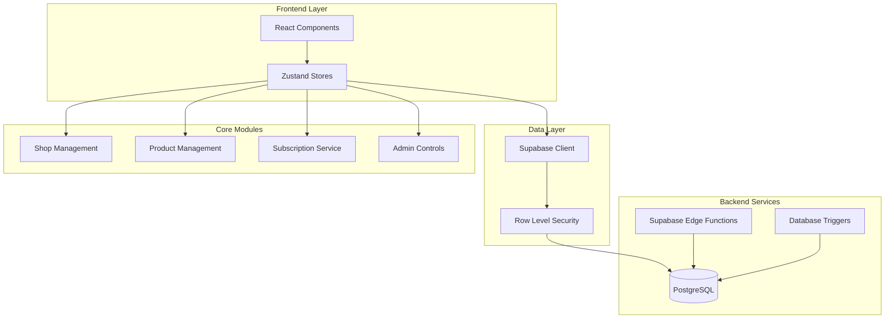

# Multi-Vendor Marketplace Design Document

## Overview

This design transforms the existing single-admin shop into a multi-vendor marketplace. The architecture extends the current product and store infrastructure while adding vendor shop management, subscription billing, and admin controls. The implementation leverages Supabase for database operations, integrates with the existing wallet system, and maintains the application's established UI patterns.

## Architecture



### Key Architectural Decisions

1. **Database-First Approach**: Subscription logic and shop status management handled via database triggers and scheduled functions to ensure consistency
2. **RLS for Authorization**: Row Level Security policies enforce vendor product isolation
3. **Existing Component Reuse**: Extend ProductCard, ProductsManagement, and store patterns
4. **Wallet Integration**: Use existing wallet deduction patterns for fee processing
5. **Supabase Storage for Images**: Product images stored in Supabase Storage bucket with public URLs for display

## Components and Interfaces

### New Pages

| Component | Path | Description |
|-----------|------|-------------|
| `VendorOnboarding` | `/vendor/onboard` | Shop creation flow with fee payment |
| `VendorDashboard` | `/vendor/dashboard` | Vendor's shop management hub |
| `VendorProducts` | `/vendor/products` | Product CRUD for vendors |
| `VendorShopPage` | `/shop/:shopId` | Public vendor profile page |
| `AdminVendorManagement` | `/admin/vendors` | Admin vendor shop listing |
| `AdminMarketplaceSettings` | `/admin/marketplace-settings` | Subscription fee configuration |

### New Stores (Zustand)

```typescript
// src/store/vendorStore.ts
interface VendorStore {
  shop: VendorShop | null;
  loading: boolean;
  fetchShop: () => Promise<void>;
  createShop: (data: CreateShopData) => Promise<CreateShopResult>;
  updateShop: (data: UpdateShopData) => Promise<void>;
}

// src/store/vendorProductStore.ts
interface VendorProductStore {
  products: Product[];
  loading: boolean;
  fetchVendorProducts: () => Promise<void>;
  addProduct: (product: CreateProductData) => Promise<void>;
  updateProduct: (id: string, data: Partial<Product>) => Promise<void>;
  deleteProduct: (id: string) => Promise<void>;
}

// src/store/adminVendorStore.ts
interface AdminVendorStore {
  shops: VendorShop[];
  settings: MarketplaceSettings;
  loading: boolean;
  fetchAllShops: () => Promise<void>;
  updateShopStatus: (shopId: string, status: ShopStatus, reason?: string) => Promise<void>;
  toggleVerification: (shopId: string, verified: boolean) => Promise<void>;
  updateSubscriptionFee: (fee: number) => Promise<void>;
  fetchAuditLogs: (filters?: AuditLogFilters) => Promise<AuditLog[]>;
}
```

### Service Functions

```typescript
// src/lib/vendorService.ts
interface VendorService {
  createShop(userId: string, shopData: CreateShopData): Promise<CreateShopResult>;
  processSubscription(shopId: string): Promise<SubscriptionResult>;
  checkAndReactivateShop(userId: string): Promise<void>;
}

// src/lib/adminVendorService.ts
interface AdminVendorService {
  overrideShopStatus(shopId: string, status: ShopStatus, reason: string): Promise<void>;
  setVerificationStatus(shopId: string, verified: boolean): Promise<void>;
  updateSubscriptionFee(newFee: number): Promise<void>;
}

// src/lib/imageUploadService.ts
interface ImageUploadService {
  uploadProductImage(file: File, shopId: string): Promise<string>;
  deleteProductImage(imageUrl: string): Promise<void>;
  getPublicUrl(path: string): string;
}
```

## Data Models

### New Database Tables

```sql
-- Vendor Shops
CREATE TABLE vendor_shops (
  id UUID PRIMARY KEY DEFAULT gen_random_uuid(),
  user_id UUID REFERENCES profiles(id) NOT NULL UNIQUE,
  name VARCHAR(100) NOT NULL,
  description TEXT,
  is_verified BOOLEAN DEFAULT FALSE,
  status VARCHAR(20) DEFAULT 'active' CHECK (status IN ('active', 'disabled', 'admin_disabled')),
  admin_override BOOLEAN DEFAULT FALSE,
  subscription_due_date TIMESTAMPTZ,
  last_subscription_paid_at TIMESTAMPTZ,
  created_at TIMESTAMPTZ DEFAULT NOW(),
  updated_at TIMESTAMPTZ DEFAULT NOW()
);

-- Marketplace Settings (singleton)
CREATE TABLE marketplace_settings (
  id UUID PRIMARY KEY DEFAULT gen_random_uuid(),
  setup_fee DECIMAL(10,2) DEFAULT 500.00,
  monthly_subscription_fee DECIMAL(10,2) DEFAULT 500.00,
  updated_at TIMESTAMPTZ DEFAULT NOW()
);

-- Vendor Audit Logs
CREATE TABLE vendor_audit_logs (
  id UUID PRIMARY KEY DEFAULT gen_random_uuid(),
  admin_id UUID REFERENCES profiles(id) NOT NULL,
  action VARCHAR(50) NOT NULL,
  target_shop_id UUID REFERENCES vendor_shops(id),
  details JSONB,
  created_at TIMESTAMPTZ DEFAULT NOW()
);

-- Subscription History
CREATE TABLE subscription_history (
  id UUID PRIMARY KEY DEFAULT gen_random_uuid(),
  shop_id UUID REFERENCES vendor_shops(id) NOT NULL,
  amount DECIMAL(10,2) NOT NULL,
  status VARCHAR(20) NOT NULL CHECK (status IN ('success', 'failed')),
  transaction_id UUID REFERENCES transactions(id),
  billing_period_start TIMESTAMPTZ NOT NULL,
  billing_period_end TIMESTAMPTZ NOT NULL,
  created_at TIMESTAMPTZ DEFAULT NOW()
);
```

### Modified Tables

```sql
-- Add shop_id to products table
ALTER TABLE products ADD COLUMN shop_id UUID REFERENCES vendor_shops(id);
ALTER TABLE products ADD COLUMN is_vendor_product BOOLEAN DEFAULT FALSE;

-- Add new transaction types
-- Transaction type enum extended: 'shop_setup_fee', 'shop_subscription'
```

### Supabase Storage Configuration

```sql
-- Create storage bucket for vendor product images
INSERT INTO storage.buckets (id, name, public)
VALUES ('vendor-products', 'vendor-products', true);

-- Storage policies for vendor product images
CREATE POLICY "Vendors can upload images to their shop folder"
ON storage.objects FOR INSERT
WITH CHECK (
  bucket_id = 'vendor-products' AND
  auth.uid()::text = (storage.foldername(name))[1]
);

CREATE POLICY "Vendors can update their own images"
ON storage.objects FOR UPDATE
USING (
  bucket_id = 'vendor-products' AND
  auth.uid()::text = (storage.foldername(name))[1]
);

CREATE POLICY "Vendors can delete their own images"
ON storage.objects FOR DELETE
USING (
  bucket_id = 'vendor-products' AND
  auth.uid()::text = (storage.foldername(name))[1]
);

CREATE POLICY "Anyone can view vendor product images"
ON storage.objects FOR SELECT
USING (bucket_id = 'vendor-products');
```

### Image Upload Flow

1. Vendor selects image file in product form
2. Frontend validates file type (jpg, png, webp) and size (max 5MB)
3. Image uploaded to `vendor-products/{user_id}/{timestamp}_{filename}`
4. Public URL returned and stored in product's `image_url` field
5. On product deletion, associated image is also deleted from storage

### TypeScript Types

```typescript
// src/types/vendor.ts
export type VendorShop = {
  id: string;
  user_id: string;
  name: string;
  description: string;
  is_verified: boolean;
  status: 'active' | 'disabled' | 'admin_disabled';
  admin_override: boolean;
  subscription_due_date: string;
  last_subscription_paid_at: string;
  created_at: string;
  updated_at: string;
  // Joined fields
  vendor_name?: string;
  product_count?: number;
};

export type MarketplaceSettings = {
  id: string;
  setup_fee: number;
  monthly_subscription_fee: number;
  updated_at: string;
};

export type VendorAuditLog = {
  id: string;
  admin_id: string;
  action: 'fee_change' | 'verification_change' | 'status_override';
  target_shop_id: string | null;
  details: {
    previous_value?: any;
    new_value?: any;
    reason?: string;
  };
  created_at: string;
  admin_name?: string;
  shop_name?: string;
};

export type SubscriptionHistory = {
  id: string;
  shop_id: string;
  amount: number;
  status: 'success' | 'failed';
  transaction_id: string | null;
  billing_period_start: string;
  billing_period_end: string;
  created_at: string;
};

export type CreateShopData = {
  name: string;
  description: string;
};

export type CreateShopResult = {
  success: boolean;
  shop?: VendorShop;
  error?: 'insufficient_balance' | 'already_vendor' | 'creation_failed';
};
```

## Correctness Properties

*A property is a characteristic or behavior that should hold true across all valid executions of a system-essentially, a formal statement about what the system should do. Properties serve as the bridge between human-readable specifications and machine-verifiable correctness guarantees.*

### Property 1: Wallet Balance Validation for Shop Creation
*For any* user attempting to create a shop, if their wallet balance is less than the setup fee, the shop creation SHALL be rejected and no wallet deduction SHALL occur.
**Validates: Requirements 1.3, 1.4**

### Property 2: Shop Creation Fee Deduction
*For any* successful shop creation, the user's wallet balance SHALL be reduced by exactly the setup fee amount, and a transaction record with type "shop_setup_fee" SHALL exist.
**Validates: Requirements 1.5, 1.6**

### Property 3: Vendor Product Isolation
*For any* vendor, all products returned by their product management queries SHALL have a shop_id matching their shop, and any create/update/delete operation SHALL only affect products with matching shop_id.
**Validates: Requirements 2.1, 2.2, 2.3, 2.4**

### Property 4: Product Validation
*For any* product creation attempt missing required fields (name, description, price, image_url, category, in_stock), the creation SHALL be rejected.
**Validates: Requirements 2.5**

### Property 4a: Image Upload Validation
*For any* image upload attempt, if the file type is not jpg/png/webp or file size exceeds 5MB, the upload SHALL be rejected.
**Validates: Requirements 2.5**

### Property 5: Subscription Billing Records Transaction
*For any* shop where subscription billing succeeds, the shop status SHALL remain 'active' and a subscription_history record with status 'success' SHALL exist.
**Validates: Requirements 3.1, 3.2**

### Property 6: Failed Subscription Disables Shop
*For any* shop where subscription billing fails due to insufficient balance, the shop status SHALL change to 'disabled' and all products from that shop SHALL be excluded from public store queries.
**Validates: Requirements 3.3, 3.4**

### Property 7: Wallet Funding Triggers Reactivation
*For any* disabled shop (due to failed subscription) where the vendor's wallet is funded with sufficient balance, the system SHALL attempt fee collection, and upon success, the shop status SHALL change to 'active'.
**Validates: Requirements 3.5, 3.6**

### Property 8: Public Shop Displays Active Products
*For any* active vendor shop, the public shop page query SHALL return all products where in_stock is true and the shop is active.
**Validates: Requirements 4.3**

### Property 9: Verification Badge Visibility
*For any* shop, the is_verified field value SHALL match the visibility of the verification badge in all public views (shop profile and product listings).
**Validates: Requirements 4.4, 7.2, 7.3**

### Property 10: Disabled Shop Unavailable
*For any* shop with status 'disabled' or 'admin_disabled', public access attempts SHALL return an unavailable status.
**Validates: Requirements 4.5**

### Property 11: Shop List Contains Required Fields
*For any* shop returned in the admin vendor list, the response SHALL include shop name, vendor name, status, is_verified, and subscription_due_date fields.
**Validates: Requirements 5.2**

### Property 12: Shop Search Filters Correctly
*For any* search query in the admin vendor list, all returned shops SHALL have either shop name or vendor name containing the search term (case-insensitive).
**Validates: Requirements 5.3**

### Property 13: Fee Update Applies to Future Charges
*For any* subscription fee update, all subscription charges occurring after the update timestamp SHALL use the new fee value.
**Validates: Requirements 6.2**

### Property 14: Fee Change Audit Logging
*For any* subscription fee change, a vendor_audit_log entry SHALL exist with action 'fee_change', the admin_id, and details containing both previous and new fee values.
**Validates: Requirements 6.3, 9.1**

### Property 15: Verification Change Audit Logging
*For any* verification status change, a vendor_audit_log entry SHALL exist with action 'verification_change', the admin_id, target_shop_id, and the new verification status.
**Validates: Requirements 7.4, 9.2**

### Property 16: Admin Disable Hides Shop
*For any* admin disable action on a shop, the shop status SHALL immediately change to 'admin_disabled' and all products SHALL be excluded from public queries.
**Validates: Requirements 8.2**

### Property 17: Admin Enable Restores Visibility
*For any* admin enable action on an 'admin_disabled' shop with current subscription, the shop status SHALL change to 'active' and products SHALL appear in public queries.
**Validates: Requirements 8.3**

### Property 18: Admin Override Prevents Auto-Status Change
*For any* shop with admin_override set to true, automated subscription billing logic SHALL NOT modify the shop status.
**Validates: Requirements 8.4**

### Property 19: Admin Status Change Audit Logging
*For any* admin shop status override, a vendor_audit_log entry SHALL exist with action 'status_override', admin_id, target_shop_id, and details containing the action type and reason.
**Validates: Requirements 8.5, 9.3**

### Property 20: Store Shows All Active Shop Products
*For any* public store query, the results SHALL include products from all shops where status is 'active' and the product's in_stock is true.
**Validates: Requirements 10.1**

### Property 21: Product Displays Shop Info
*For any* product displayed in the store, the response SHALL include the associated shop name and is_verified status.
**Validates: Requirements 10.2**

### Property 22: Shop Filter Works Correctly
*For any* store query with a shop filter, all returned products SHALL have shop_id matching the filter value.
**Validates: Requirements 10.3**

### Property 23: Disabled Shop Products Excluded
*For any* shop with status 'disabled' or 'admin_disabled', all products from that shop SHALL be excluded from public store listings and search results.
**Validates: Requirements 10.4**

## Error Handling

| Error Scenario | Handling Strategy |
|----------------|-------------------|
| Insufficient wallet balance for shop creation | Return `insufficient_balance` error, prompt user to fund wallet |
| User already has a shop | Return `already_vendor` error, redirect to vendor dashboard |
| Subscription payment fails | Set shop status to 'disabled', log failure in subscription_history |
| Vendor tries to edit another vendor's product | RLS policy blocks operation, return authorization error |
| Admin action on non-existent shop | Return 404 error with descriptive message |
| Database constraint violation | Catch error, return user-friendly message, log details |
| Network timeout during payment | Implement retry logic with exponential backoff |

## Testing Strategy

### Property-Based Testing Library
**fast-check** will be used for property-based testing in TypeScript/JavaScript.

### Unit Tests
- Shop creation validation logic
- Wallet balance checking
- Product ownership verification
- Subscription date calculations
- Audit log entry creation

### Property-Based Tests
Each correctness property (1-23) will be implemented as a property-based test using fast-check. Tests will:
- Generate random valid inputs (users, shops, products, wallet balances)
- Execute the operation under test
- Verify the property holds for all generated inputs
- Run minimum 100 iterations per property

Test annotations will follow the format:
```typescript
// **Feature: multi-vendor-marketplace, Property 1: Wallet Balance Validation for Shop Creation**
// **Validates: Requirements 1.3, 1.4**
```

### Integration Tests
- End-to-end shop creation flow
- Subscription billing cycle
- Admin override scenarios
- Store product filtering with vendor products

### Test Data Generators
```typescript
// Generators for property-based tests
const userGenerator = fc.record({
  id: fc.uuid(),
  walletBalance: fc.float({ min: 0, max: 100000 }),
  isAdmin: fc.boolean()
});

const shopGenerator = fc.record({
  id: fc.uuid(),
  name: fc.string({ minLength: 1, maxLength: 100 }),
  status: fc.constantFrom('active', 'disabled', 'admin_disabled'),
  is_verified: fc.boolean(),
  admin_override: fc.boolean()
});

const productGenerator = fc.record({
  id: fc.uuid(),
  name: fc.string({ minLength: 1, maxLength: 200 }),
  price: fc.float({ min: 0.01, max: 1000000 }),
  in_stock: fc.boolean(),
  shop_id: fc.uuid()
});
```
